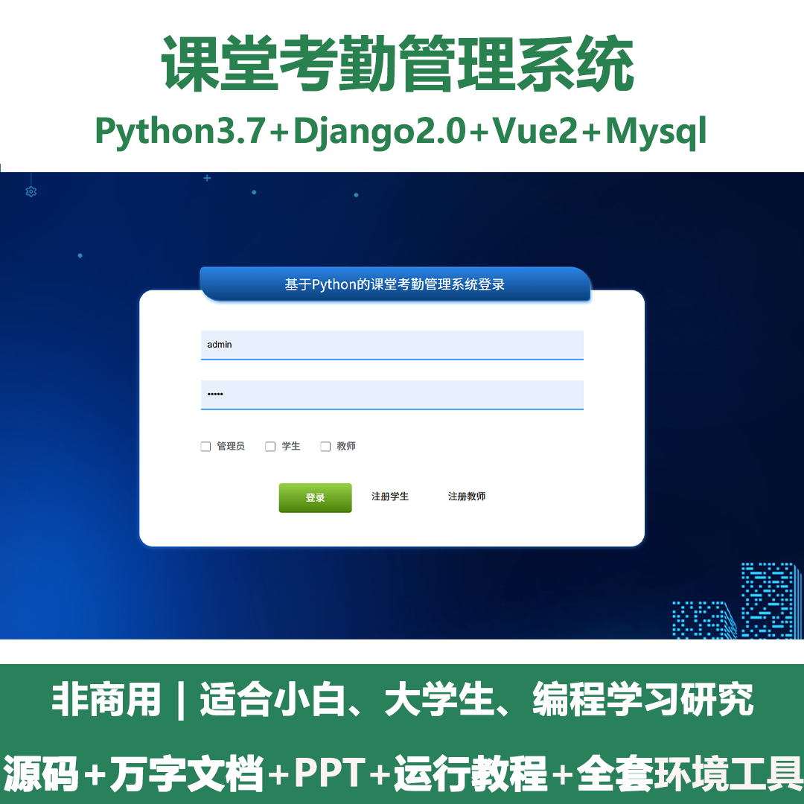
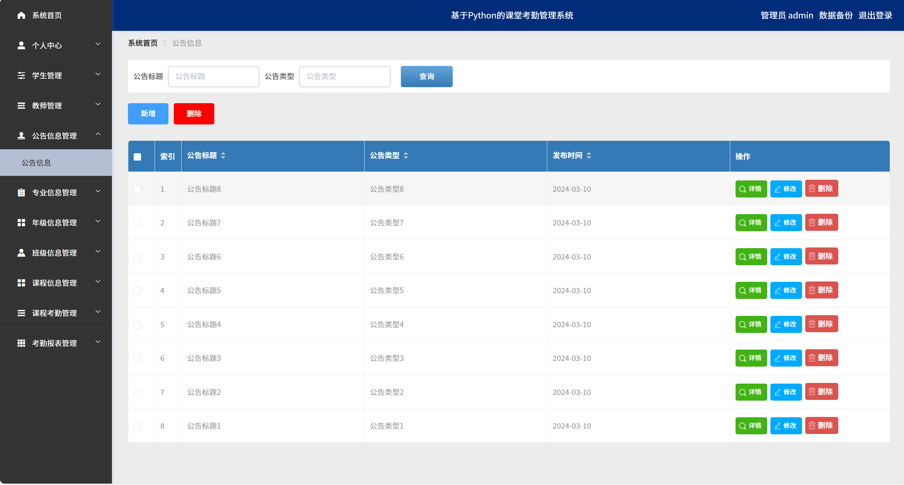
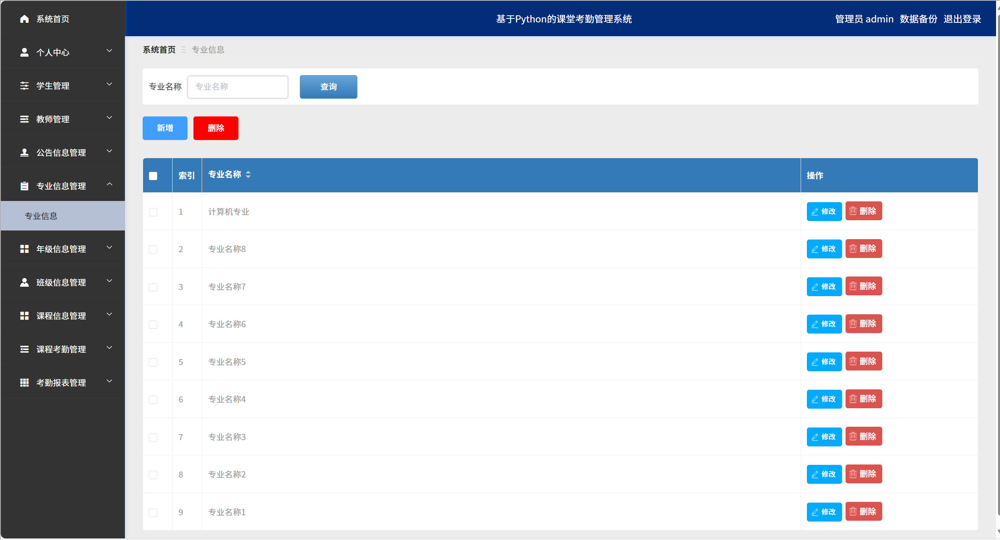
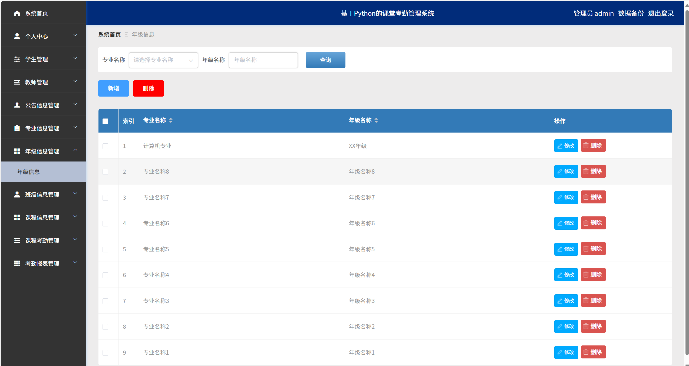
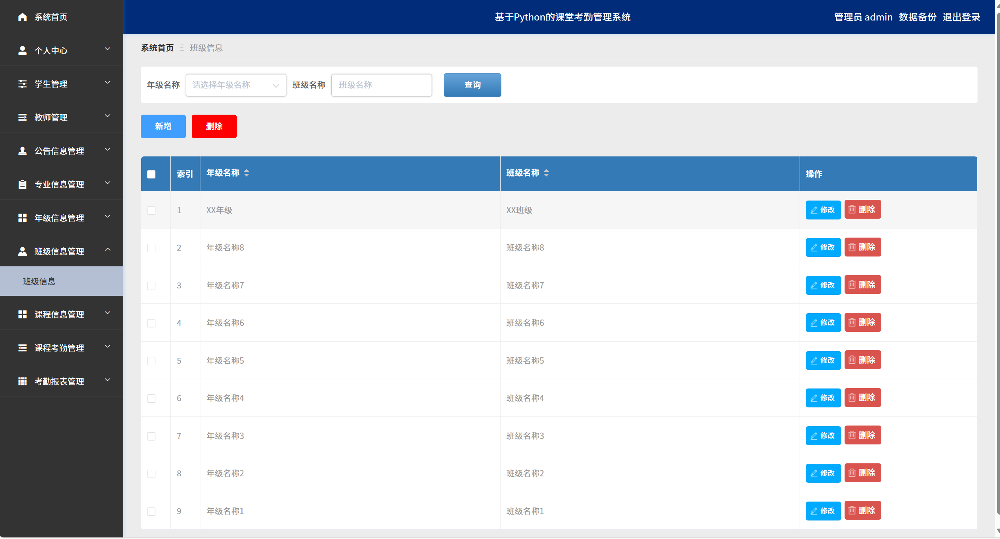
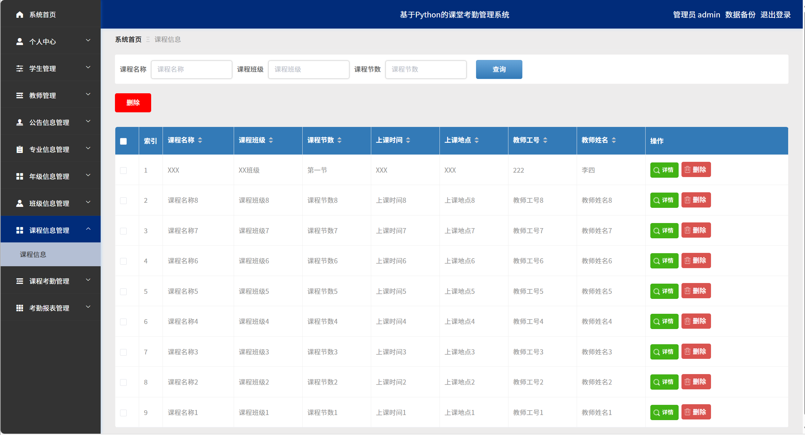
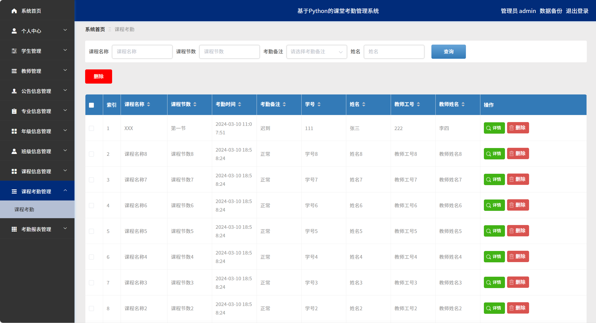
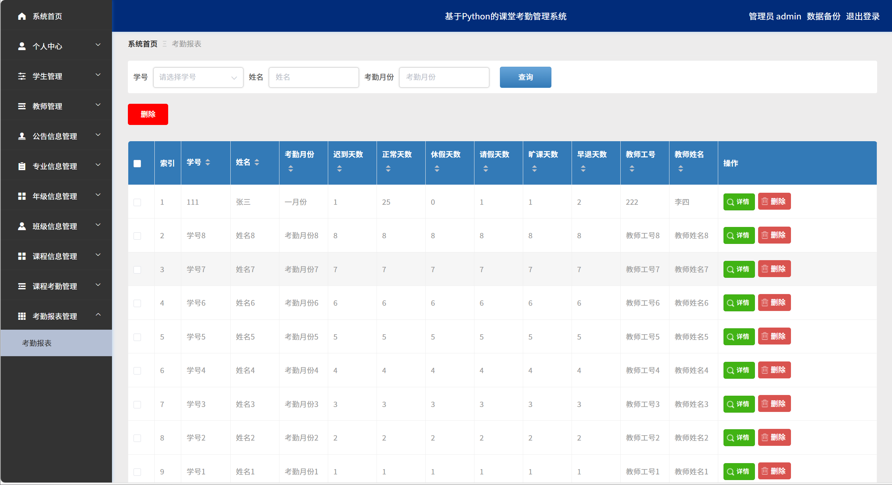
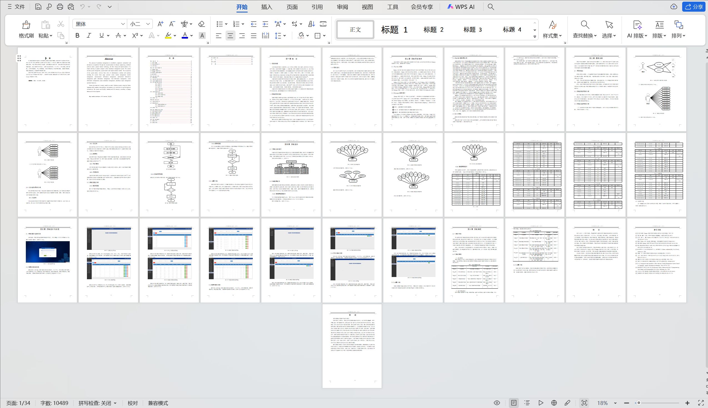

# python089
python089基于Python+Django的课堂考勤管理系统+LW+PPT
 
## 查看主页获取源码

### 一、关键词
课程考勤管理系统，班级考勤登记系统，学生出勤记录系统

### 二、作品包含
源码+数据库+设计文档万字+PPT+全套环境和工具资源+本地部署教程

### 三、项目技术
前端技术：Vue2.0、Element-ui
后端技术：Python3.7、Django2.0

### 四、运行环境（以下版本亲测，其他版本兼容性请自行测试）
开发工具：PyCharm + VSCODE

数据库：MySQL5.7（最低要5.7版本）

数据库管理工具：Navicat10+

Python：Python3.7

前端Nodejs：14

浏览器：谷歌浏览器

### 五、项目介绍
项目编号：python089

对考勤管理的流程进行科学整理、归纳和功能的精简，通过软件工程的研究方法，结合当下流行的互联网技术，最终设计并实现了一个简单、易操作的计算机学院考勤管理系统。内容包括系统的设计思路、系统模块和实现方法。系统使用过程主要涉及到管理员、学生和教师三种角色，主要包含系统首页，个人中心，学生管理，教师管理，公告信息管理，专业信息管理，年级信息管理，班级信息管理，课程信息管理，课程考勤管理，考勤报表管理等功能。

### 六、运行截图

